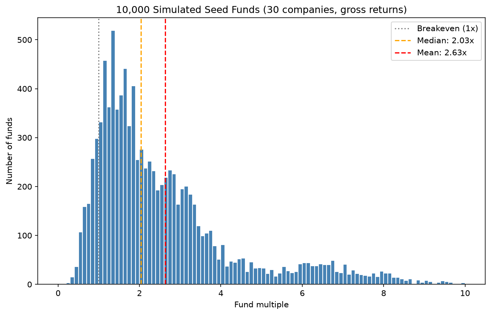
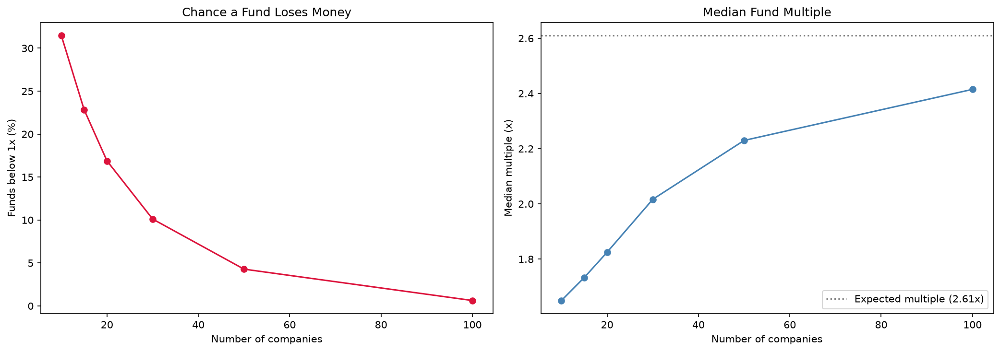

# Seed Fund Returns Simulator

The goal of this project is to understand how venture capital funds make money when most of the startups they invest in fail. By simulating thousands of seed funds, I break down how a few large winners drive a fund's returns, how often funds lose money, and how the number of companies in a portfolio changes both risk and return.

**Note:** As a beginner, I created this project to better understand how VC funds work and how they make money. It should be noted that this is a learning project, so the model is simplified and is not meant to be used for any investment decisions.

## How It Works

Each startup is assigned an outcome based on published data from Correlation Ventures, Horsley Bridge, and AngelList, ranging from a total loss (0x) to a rare 150x return. The simulator builds funds of startups, calculates each fund's overall return, and repeats this 10,000 times to find patterns.

## Key Findings

* **The typical fund earns less than the average fund.** Across 10,000 funds of 30 startups, the average return was 2.62x, but the median was only 2.07x, because a few funds with huge winners pull the average up.
* **About 1 in 10 funds lost money,** even with 30 companies and the same strategy.
* **Investing in more companies lowers risk but limits upside.** The chance of losing money fell from about 31% at 10 companies to under 1% at 100, while the top 10% of funds dropped from 5.90x to 4.01x.
* **The benefit of adding companies shrinks.** Going from 10 to 50 companies raised the median by 0.57x, while going from 50 to 100 raised it by only 0.18x.

## Limitations

This simulation simplifies how real funds work in a few important ways:

* **Investor skill:** every fund has the same odds, while real investors differ in which companies they can access and pick.
* **Ownership and follow on investments:** every company gets the same check, while real funds own different stakes and invest more in their winners.
* **Timing:** the model ignores how long companies take to exit, which affects annual returns (IRR).
* **Historical data:** the outcome probabilities come from past decades, and recent startups may perform differently.
* **Fees:** results are before management fees and carry, which lower what investors actually receive.

## How to Run

1. Install the required libraries: `pip install numpy matplotlib`
2. Open `simulator.ipynb` in Jupyter or VS Code and run all cells.

Since no seed is set, results will vary slightly with each run, but the overall patterns stay the same.
